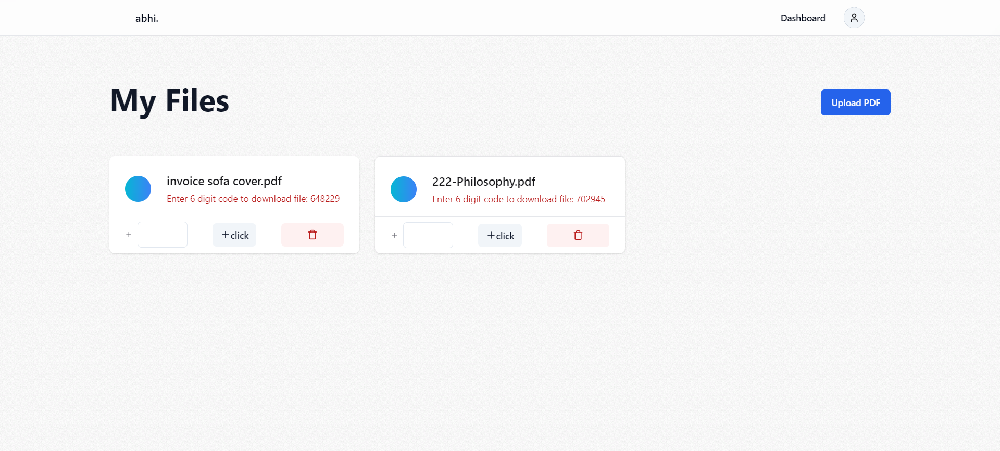
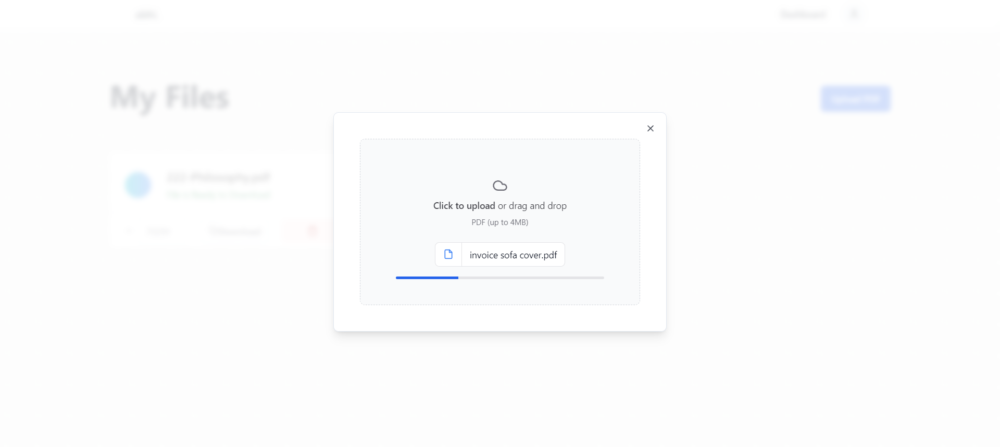

This is a [Next.js](https://nextjs.org/) project bootstrapped with [`create-next-app`](https://github.com/vercel/next.js/tree/canary/packages/create-next-app).

## Live Demo Website: [https://react-file-manager-production.up.railway.app/](https://react-file-manager-production.up.railway.app/)

## screenshots:




## Getting Started

First, run the development server:

```bash
npm run dev
# or
yarn dev
# or
pnpm dev
# or
bun dev
```

Open [http://localhost:3000](http://localhost:3000) with your browser to see the result.

You can start editing the page by modifying `app/page.tsx`. The page auto-updates as you edit the file.

This project uses [`next/font`](https://nextjs.org/docs/basic-features/font-optimization) to automatically optimize and load Inter, a custom Google Font.

## Learn More

# File Manager Website Documentation

Welcome to the File Manager website documentation! This guide will help you understand and navigate through the features of our application.

## Table of Contents
- [File Manager Website Documentation](#file-manager-website-documentation)
  - [Table of Contents](#table-of-contents)
  - [Introduction](#introduction)
  - [Getting Started](#getting-started-1)
    - [Installation](#installation)

## Introduction

Our file manager website is built using React, Next.js, TypeScript, and other modern technologies to provide a seamless and secure experience for managing your files.

## Getting Started

### Installation

Clone the repository and install dependencies:

```bash
git clone <https://github.com/nishchal27/react-file-manager.git>

npm install


Environment Variables
Create a .env file in the root directory with the following variables:
there is .env.example file available in the code repo

User Authentication
Sign Up
To create an account, navigate to the homepage and click on "Sign Up." Fill in the required information and click "Sign Up."


Sign In
If you already have an account, click on "Sign In" and enter your credentials.


Dashboard
Upon successful sign-in, you'll be directed to your dashboard, displaying a list of your files.


File Operations
Upload Files
To upload a file, click on the "Upload" button on the dashboard. Choose a file and click "Upload."


Download Files
To download a file, click on the file in your dashboard, and then click "Download."

Delete Files
To delete a file, click on the file in your dashboard, and then click "Delete."

Payment Integration
Our website uses Stripe for secure payment transactions. Ensure your payment information is accurate during the checkout process.

To learn more about Next.js, take a look at the following resources:

- [Next.js Documentation](https://nextjs.org/docs) - learn about Next.js features and API.
- [Learn Next.js](https://nextjs.org/learn) - an interactive Next.js tutorial.

You can check out [the Next.js GitHub repository](https://github.com/vercel/next.js/) - your feedback and contributions are welcome!

